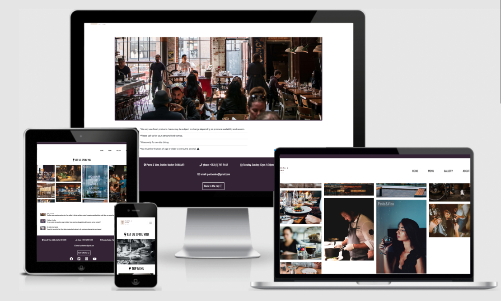
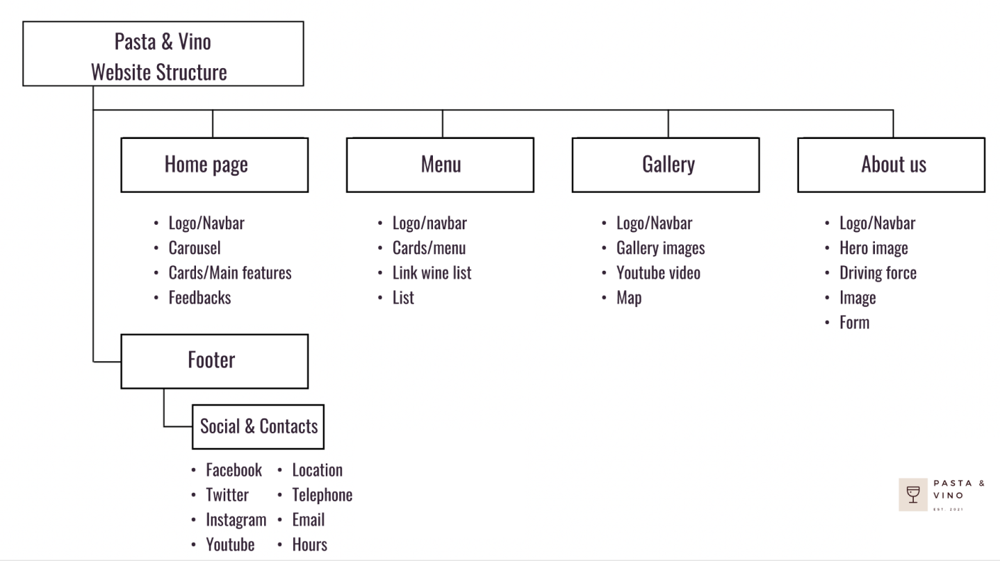
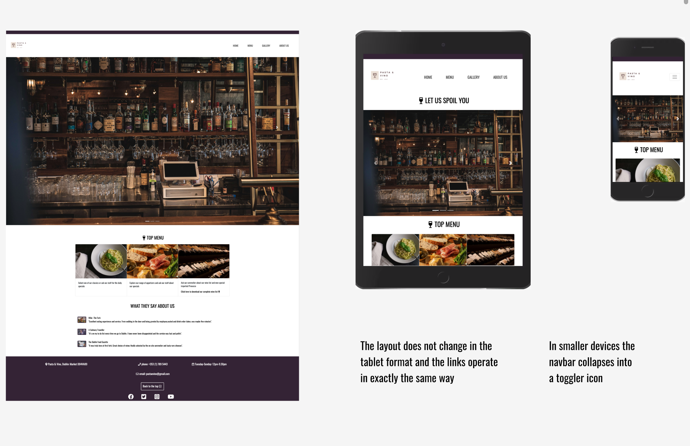
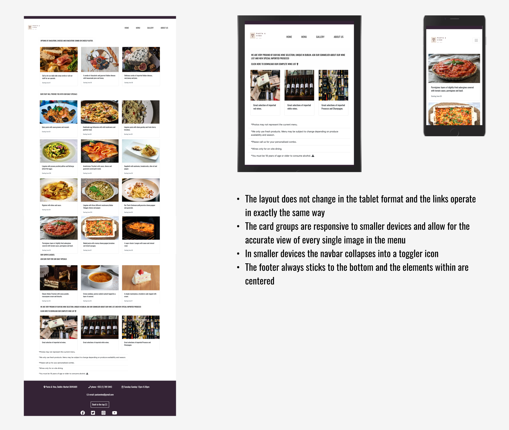
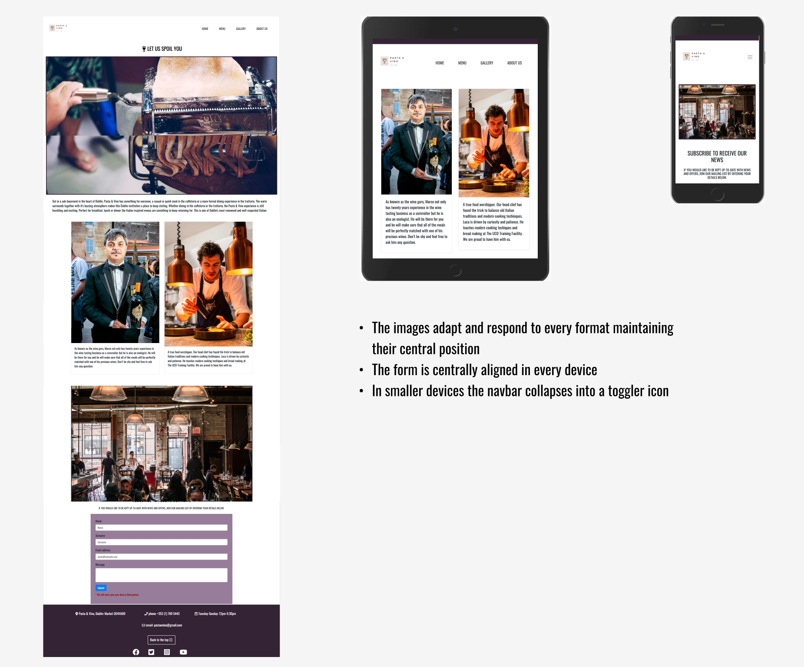

<h1 align="center">Pasta & Vino</h1>

[View the live project here](https://8000-gray-capybara-0uwz61wk.ws-eu03.gitpod.io/)

## Introduction

This comprehensive website has been designed for the restaurant/wine bar "Pasta & Vino". 

It is designed to be responsive and accessible on a range of devices, making it easy to navigate for potential students and partners.

The focus of the site is to create an online presence allowing wine lovers and clients in general, to find out relevant information about the place,its main features, wide range of wines and location. 

"Pasta & Vino" is a restaurant/wine bar whose strenght is in its great choice of wines and carefully selected combinations of pastas and chacuteries.

This is the first of four Milestone Projects that the developer must complete during their Full Stack Web Development Program at The Code Institute. 

The main requirements were to make a responsive and static website with a minimum of three pages using primarily **HTML5** and **CSS3**.

## User Experience (UX)

-   ### User stories

    -   #### First Time Visitor Goals

        1. As a First Time Visitor, I want to easily understand the main purpose of the site and learn more about the restaurant and its main features.
        2. As a First Time Visitor, I want to be able to easily navigate throughout the site to find content and products.
        3. As a First Time Visitor, I want to look for feedbacks and menu to understand what their users think of them. I also want to locate their social media links to see their followings on social media to determine how reliable and popular they are.

    -   #### Returning Visitor Goals

        1. As a Returning Visitor, I want to find information new imported products and changes in the menu.
        2. As a Returning Visitor, I want to find the best way to get in contact with the restaurant with any questions I may have or simply to secure a seat.
        3. As a Returning Visitor, I want to find community links.

    -   #### Frequent User Goals
        1. As a Frequent User, I want to check to see if there are any newly added features regarding the kitchen.
        2. As a Frequent User, I want to check to see if there are any updates in the wines and spirits list.
        3. As a Frequent User, I want to sign up to the Newsletter so that I am emailed any major updates and/or discounts or special events.

#### Strategy
Broken into three categories, the website will focus on the following target audiences:
- **Roles:**
- Current clients of the restaurant
- Future clients
- Wine lovers in town

- **Demographic:**
- 18 or above for the wines and spirits
- Any age for the restaurant food menu
- Whoever is in search of a wine experience

The website needs to enable the **User** to:
- Retrieve desired information:
- Menu information
- New imported products
- Upcoming tasting events
- Contact information (standard and social enquires)

The website needs to enable the **Restaurant** to:
- Develop an online presence 
- Provide an easily navigable website for users to find relevant information about:
 - New products
 - New menu and special features connected to the kitchen
 - Provide a channel of communication for enquires (via the form or social media)
 - Provide a channel of communication for new and current clients (Social Links - easily accessible throughout the site with a click)

#### Scope
A scope was defined in order to identify what features have to be included based on the strategy previously defined. This was broken into two categories:
- **Content Requirements**
- The user will be looking for:
 - General information
 - New products
 - Feedbacks
 - Contact details
 - Social Links
- **Functionality Requirements**
 - The user will be able to:
    - Easily navigate through the site in order to find the information they want
    - Be able to find links to external sites in order to:
        - Verify the status of the place
        - Find directions
        - Have always under control news and specials
        - Contact the restaurant directly through the contacts

#### Structure
The information architecture was organized in a fluid and clear way in order to ensure that users could navigate through the site with ease and efficiency.

#### Skeleton 
Wireframe mockups were created in a [Figma Workspace](https://www.figma.com/file/N6vxVhX02vOxUAnFLUACMH/First-framework?node-id=0%3A1).
Several style changes were made in the final project compared to the inital wireframe on Figma. Those changes were mainly related to the choice of different pictures to better suit the new layout and Bootstrap features (e.g. Carousel,cards etc), colours, font size, positioning in the page; all aimed to provide the best user experience and responsiveness.

**Pages:**
 1. Home Page:
 

 2. Menu

 
 
 3. Gallery

  

 4. About us

  

### Design

#### Colour Scheme
  - The main colours used throughout the website are a mixture of dark purple (to represent the colour of wine), White (as a clear and non-invasive contrast colour to the previous one), black fonts.

#### Typography
  -   The Oswald font is the main font used throughout the whole website with Nunito as the fallback font in case for any reason the font isn't being imported into the site correctly.

#### Imagery
  -   Imagery is extremely important in hospitality related websites. It is designed to be striking and catch the user's attention. 
      The carousel right at the homepage is an immediate example of an element that catches the attention of the user with the most important features of the place.

  - It also has a modern but classic aesthetic. The imagery it has been thought carefully to draw the attention of the user straight to the points of strenght of the restaurant.

## Features

-   Responsive on all device sizes

-   Interactive elements

Each page of the website features a consistent responsive navigational system:
- The **Header** contains a conventionally placed **logo** in the top left of the page (whereby by clicking this will redirect users back to the home page) and **navigation bar** in the top right of the page.
- On smaller screens, the navigation bar collapses into a **toggler** icon whereby clicking it will reveal the navigation links.
- The **Footer** and the elements inside it (Social links and contacts) act responsively on smaller screens and it look as normal on bigger screens.

## Technologies Used

### Languages Used

-   [HTML5](https://en.wikipedia.org/wiki/HTML5)
-   [CSS3](https://en.wikipedia.org/wiki/Cascading_Style_Sheets)

### Frameworks, Libraries & Programs Used

1. [Bootstrap 4.6:](https://getbootstrap.com/docs/4.6/getting-started/introduction/)
    - Bootstrap was used to assist with the responsiveness and styling of the website.
1. [Tiny png:](https://tinypng.com/)
    - Tiny png was used to compress all of the images.
1. [Google Fonts:](https://fonts.google.com/)
    - Google fonts were used to import the fonts.
1. [Font Awesome:](https://fontawesome.com/)
    - Font Awesome was used on all pages throughout the website to add icons for aesthetic and UX purposes.
1. [jQuery:](https://jquery.com/)
    - jQuery came with Bootstrap to make the navbar responsive but was also used for the smooth scroll function in JavaScript.
1. [Git](https://git-scm.com/)
    - Git was used for version control by utilizing the Gitpod terminal to commit to Git and Push to GitHub.
1. [GitHub:](https://github.com/)
    - GitHub is used to store the projects code after being pushed from Git.
1. [Favicon:](https://favicon.io/)
    - Favicon was used to create the icon.
1. [Figma:](https://www.figma.com/login)
    - Figma was used to create the [wireframes](https://github.com/) during the design process.
1. [Unsplash:](https://unsplash.com/)
    - Unsplash was used to download pictures based on the specific features of each page, intended orientation of the images in the pages and best match with bootstrap elements.
1. [Canva:](https://www.canva.com/design/)
    - Canva was used to create the logo.

## Testing

Testing information can be found in a separate testing [file](TESTING.md "Link to testing file")

## Deployment

### Deploying on GitHub Pages
To deploy this page to GitHub Pages from its GitHub repository, the following steps were taken:

1. Log into [GitHub](https://github.com/login "Link to GitHub login page") or [create an account](https://github.com/join "Link to GitHub create account page").
2. Locate the [GitHub Repository](https://github.com/FrankN88/FrankN88-first_milestone_new "Link to GitHub Repo").
3. At the top of the repository, select Settings from the menu items.
4. Scroll down the Settings page to the "GitHub Pages" section.
5. Under "Source" click the drop-down menu labelled "None" and select "Master Branch".
6. Upon selection, the page will automatically refresh meaning that the website is now deployed.
7. Scroll back down to the "GitHub Pages" section to retrieve the deployed link.
8. At the time of submitting this Milestone project the Development Branch and Master Branch are identical.

### Forking the Repository
By forking the GitHub Repository we make a copy of the original repository on our GitHub account to view and/or make changes without affecting the original repository by using the following steps...

1. Log into [GitHub](https://github.com/login "Link to GitHub login page") or [create an account](https://github.com/join "Link to GitHub create account page").
2. Locate the [GitHub Repository](https://github.com/FrankN88/FrankN88-first_milestone_new "Link to GitHub Repo").
3. At the top of the repository, on the right side of the page, select "Fork"
4. You should now have a copy of the original repository in your GitHub account.

### Creating a Clone
How to run this project locally:
1. Install the [GitPod Browser](https://www.gitpod.io/docs/browser-extension/ "Link to Gitpod Browser extension download") Extension for Chrome.
2. After installation, restart the browser.
3. Log into [GitHub](https://github.com/login "Link to GitHub login page") or [create an account](https://github.com/join "Link to GitHub create account page").
2. Locate the [GitHub Repository](https://github.com/FrankN88/FrankN88-first_milestone_new "Link to GitHub Repo").
5. Click the green "GitPod" button in the top right corner of the repository.
This will trigger a new gitPod workspace to be created from the code in github where you can work locally.

Click [Here](https://help.github.com/en/github/creating-cloning-and-archiving-repositories/cloning-a-repository#cloning-a-repository-to-github-desktop) to retrieve pictures for some of the buttons and more detailed explanations of the above process.

## Credits

### Code

The developer consulted multiple sites in order to better understand the code that was trying to implement. The following sites were used on a more regular basis:
- [Stack Overflow](https://stackoverflow.com/ "Link to Stack Overflow page")
- [W3Schools](https://www.w3schools.com/ "Link to W3Schools page")
- [Bootstrap](https://getbootstrap.com/ "Link to BootStrap page")
- [MDN Web Docs](https://developer.mozilla.org/en-US/ "Link to MDN Web Docs")

### Content

-   All content was written by the developer (except for the Bootstrap features).

-   Psychological properties of colours text in the README.md was found [here](http://www.colour-affects.co.uk/psychological-properties-of-colours)

### Media
- Some Images come from my personal archives

- All the other Images were downloaded from [Unsplash](https://unsplash.com/ "Link to Unsplash page").

### Acknowledgements

- My Mentor for continuous helpful feedback.

- Tutor support at Code Institute for their support.

- My family for opinions and feedbacks.

