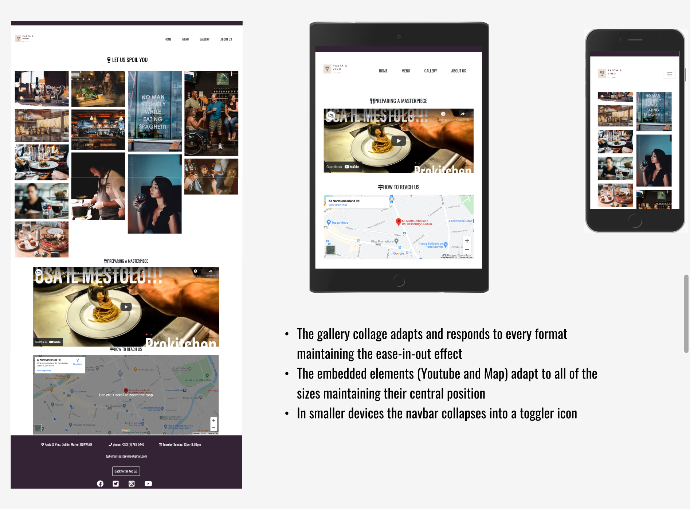

<h1 align="center">Pasta & Vino</h1>

[View the live project here](https://frankn88.github.io/MS1_Pasta-Wine/)

[View the testing information here - (TESTING.md) ](TESTING.md)

## Table of contents
1. [Introduction](#Introduction)
2. [UX](#UX)
    1. [UX - User Stories](#User-Stories)
      - [First Time Visitor Goals](#First-Time-Visitor-Goals)
      - [Returning Visitor Goals](#Returning-Visitor-Goals)
      - [Frequent User Goals](#Frequent-User-Goals)
      - [Site Owner Goals](#Site-Owner-Goals)
    2. [Strategy](#Strategy)
    3. [Scope](#Scope)
    3. [Structure](#Structure)
    4. [Skeleton](#Skeleton)
    5. [Surface](#Surface)
3. [Features](#Features)
    1. [Design Features](#Design-Features) 
    2. [Features to Implement in the future](#Features-to-Implement-in-the-future)
4. [Issues and Bugs](#Issues-and-Bugs)
5. [Technologies Used](#Technologies-Used)
     1. [Languages Used](#Languages-Used)
     2. [Frameworks, Libraries & Programs Used](#Frameworks,-Libraries-&-Programs-Used)
6. [Testing](#Testing)
     1. [Testing.md](TESTING.md)
7. [Deployment](#Deployment)
     1. [Deploying on GitHub Pages](#Deploying-on-GitHub-Pages)
     2. [Forking the Repository](#Forking-the-Repository)
     3. [Creating a Clone](#Creating-a-Clone)
8. [Credits](#Credits)
     1. [Content](#Content)
     2. [Media](#Media)
     3. [Code](#Code)
9. [Acknowledgements](#Acknowledgements)
***

## Introduction

This comprehensive website has been designed for the restaurant/ wine bar "Pasta & Vino". 

It is designed to be responsive and accessible on a range of devices, making it easy to navigate for potential students and partners.

The purpose of the site is to create an online presence allowing wine lovers and clients in general, to find out relevant information about the place, its main features, wide range of wines and location. 

"Pasta & Vino" is a restaurant/ wine bar and its strength is its great choice of wines and carefully selected combinations of pastas and chacuteries.

This is the first of four Milestone Projects that the developer must complete during their Full Stack Web Development Program at The Code Institute. 

The main requirements were to make a responsive and static website with a minimum of three pages using primarily **HTML5** and **CSS3**.

## User Experience (UX)

-   ### User stories

    -   #### First Time Visitor Goals
        1. As a First Time Visitor, I want to easily understand the main purpose of the site and learn more about the restaurant and its main features.
        2. As a First Time Visitor, I want to be able to easily navigate throughout the site to find content and products.
        3. As a First Time Visitor, I want to find feedback and the menu to understand what their users think of them. I also want to locate their social media links to see their followings on social media in order to determine how reliable and popular they are.

    -   #### Returning Visitor Goals
        1. As a Returning Visitor, I want to find information about new imported products and changes to the menu.
        2. As a Returning Visitor, I want to find the best way to get in contact with the restaurant with any questions I may have or simply to secure a table.
        3. As a Returning Visitor, I want to find community links.

    -   #### Frequent User Goals
        1. As a Frequent User, I want to check to see if there are any newly added features regarding the kitchen.
        2. As a Frequent User, I want to check to see if there are any updates to the wines and spirits list.
        3. As a Frequent User, I want to sign up to the Newsletter so that I am emailed any major updates and/or discounts or notified about special events.

    -   #### Site Owner Goals
        1. Increasing the overall restaurant reputation and awareness.
        2. Give an immediate overview of the place, its main features, products and other important information.
        3. Increase percentage of in-store sales made with new imported products and, in the future, also online sales.
        4. Gain a better understanding of the audience by checking their feedback both via the website and social networks.
        5. Consequently, increase social mentions and post with regularity in order to keep attention high.
        6. Allow potential customers to fill out a contact form, sign up for the email list, visit the physical location, or simply give the restaurant a phone call.
        7. Make the website as accessible as possible.
        8. Use reviews to increase customer satisfaction.

#### Strategy
The website will focus on the following target audiences:

- **Roles:**
   - Current clients of the restaurant
   - Future clients
   - Wine lovers in town

- **Demographic:**
   - 18 or above for the wines and spirits
   - Any age for the restaurant food menu
   - Whoever is in search of a wine experience

The website needs to enable the **User** to retrieve desired information, including:
- Menu information
- New imported products
- Upcoming tasting events
- Contact information (standard and social enquires)

The website needs to enable the **Restaurant** to:
- Develop an online presence 
- Provide an easily navigable website for users to find relevant information about:
  - New products
  - New menu and special features connected to the kitchen
  - Provide a channel of communication for enquires (via the form or social media)
  - Provide a channel of communication for new and current clients (Social Links - easily accessible throughout the site with a click)

#### Scope
In order to identify what features had to be included, the scope was deifined based on the previously defined strategy. This was broken into two categories:

- **Content Requirements**
 - The user will be looking for:
  - General information
  - New products
  - Feedback
  - Contact details
  - Social links

- **Functionality Requirements**
 - The user will be able to:
   - Easily navigate through the site in order to find the information they want
 - Be able to find links to external sites in order to:
   - Verify the status of the place
   - Find directions
   - Be constantly updated about news and specials
   - Contact the restaurant directly through the Contacts

#### Structure
The information architecture was organized in a fluid and clear way in order to ensure that users could navigate through the site with ease and efficiency.

#### Skeleton 
Wireframe mockups were created in a [Figma Workspace](assets/testing_files/figma_wireframe/wireframe_figma-compressed.pdf).
The PDF file generated by Figma was too big to be loaded onto GitHub. I have compressed the file with Adobe Acrobat - Compress PDF and put it into a separate folder available for download or visualization in GitHub Desktop.

Several style changes were made in the final project compared to the inital wireframe on Figma. Those changes were mainly related to the choice of different pictures to better suit the new layout and Bootstrap features (e.g. Carousel, cards etc.), colours, font size, positioning on the page; all aimed at providing the best user experience and responsiveness.

**Pages:**
 1. Home Page:
 

 2. Menu

 
 
 3. Gallery

  

 4. About us

  

### Surface

#### Colour Scheme
  - The main colours used throughout the website are a mixture of dark purple (to represent the colour of wine), white (as a clear and non-invasive contrast colour to the previous one), and black fonts.

#### Typography
  -   The Oswald font is the main font used throughout the whole website with Nunito as the fallback font in case, for any reason, the font will not be imported into the site correctly.

#### Imagery
  -   Imagery is extremely important in hospitality related websites. It is designed to be striking and catch the user's attention. The carousel on the homepage is an immediate example of an element that catches the attention of the user with the most important features about the winebar.

  - It also has a modern but classic aesthetic. The imagery has been thought about carefully to draw the attention of the user straight to the main features of the restaurant.

## Features

### Design Features
Each page of the website features a consistent responsive navigational system:
- A responsive top **Banner** is positioned at the very beginning of the page entirely for aesthetic reasons.
- The **Header** contains a conventionally placed **logo** at the top left of the page (clicking this will redirect users back to the home page) and **navigation bar** at the top right of the page.
- On smaller screens, the navigation bar collapses into a **toggler** icon whereby clicking it will reveal the navigation and social media links.
- On larger screens, the **Footer** contains the appropriate **social media icons**, linking users to the main social media pages of the restaurant.
- In the footer, there is a mailto action above the email.
- <li><strong>Let us spoil you/Top Menu</strong> - Those <strong>call to action</strong> buttons are present at least once on every page (except for the Menu page, which is the page it redirects to) so that the users are prone to clicking, therefore visualising the menu.
</li>

<dl>
  <dt><a href="index.html" target="_blank" alt="Pasta & Vino Home Page">Home Page</a></dt>
  <dd>The Home Page consists of the following elements:
     <ul>
          <li><strong>Hero Image/carousel</strong> - Occupies 100% of the page width, from the left to the right, while being viewed on all devices. The imagery used was specifically chosen as it created an impactful first impression of the winebar/ restaurant with inspiring images, establishing user expectations for what comes next.
          </li>
          <li><strong>Card list</strong> - Occupies 80% of the page width, from left to right, while being viewed on a desktop. On mobile and tablet devices, the card list responsively positions vertically, underneath the <strong>Carousel</strong>. The purpose of the card list is to provide an area in the center to highlight the three main features of the restaurant. This style was chosen in order to draw the users' attention to the information straight away. In this, there is a <strong>call to action</strong> button which links to the external page where users are invited to check out the impressive wine/spirits list, one of the main features of the winebar/ restaurant.
          </li>
          <li><strong>Feedback</strong> - Positive <strong>reviews</strong> are positioned just below the card list to increase trust in the user.
          </li>
     </ul>
  </dd>

  <dt><a href="menu.html" target="_blank" alt="Menu Page">Menu Page</a></dt>
  <dd>The Menu page consists of the following elements:
     <ul>
          <li><strong>Card list</strong> - Occupying about 80% of the page, this comprehensive card list shows the main and most popular dishes of the restaurant. It starts with appetizers and ends with desserts.
          Once again, in the wine section of the page a <strong>call to action</strong> button is present, which redirects the user to an external PDF page with the wine/spirits menu.
          </li>
          <li><strong>Notices</strong> - At the end of the page there is a list of important information about rules and regulations about the locale.
          </li>
     </ul>
  </dd>

  <dt><a href="gallery.html" target="_blank" alt="Menu Page">Gallery Page</a></dt>
  <dd>The Gallery page consists of the following elements:
     <ul>
          <li><strong>Collage</strong> - Occupying about 50% of the page, this impressive and resposive gallery has the goal of showing the place in a way that catches the user's attention. The images have an ease-in-out effect in order to be more interesting and fun. Furthermore, every time the user hovers over the images, the name of the restaurant appears in a way that is not invasive but effective.
          </li>
          <li><strong>Google Maps</strong> - iframe embedding of Google maps shows the location of the restaurant. The map is responsive in smaller devices.
          </li>
          <li><strong>Youtube Video</strong> - iframe embedding of a Youtube video showing a chef plating up. Once again, an element intended to catch the user's attention and increase curiosity.
          </li>
     </ul>
  </dd>

  <dt><a href="about_us.html" target="_blank" alt="About us Page">About Us</a></dt>
  <dd>The About Us page consists of the following elements:
     <ul>
          <li><strong>Main Image</strong> - A catchy image designed to capture the attention of the user about a feature of the restaurant (homemade pasta) and to draw the eye to the following element.
          </li>
          <li><strong>Our Driving Force</strong> - Two cards positioned next to each other with a description of the two main protagonists of the restaurant. This part is for the users who want to know more about the two people who represent the strong points of the restaurant and its success.
          </li>
          <li><strong>Second Main Image</strong> - Catchy image designed to capture the attention of the user about a feature of the restaurant (main dining area) and as a sort of separation from the following element.
          </li>
          <li><strong>Form</strong> - A standard form for the users who want to subscribe.
          </li>
     </ul>
  </dd>

  </dl>

### Features to Implement in the future

- **Merchandise Shop**

     - Feature - A shop where clients can buy wines or book tables directly via the website.
     - Reason for not featuring in this release - Not possible with only CSS and HTML.

     - Feature - Operational form.
     - Reason for not featuring in this release - Not possible with only CSS and HTML.

## Issues and Bugs 

The developer ran into a number of issues during the development of the pages.
The guiding approach in developing the website was the motto: "Mobile First". This aims to create better experiences for users by starting the design process from the smallest of screens: a mobile.

**Navbar issue** - An initial issue was to position the navbar links aligned to the logo. This was resolved with a few trials on where to position the right div.

**Social Links Bug** - A bug was found when testing the social media links. It would not redirect to the right page, giving an error message. It has been resolved by inserting a more complete URL.

**Gallery Issue** - A great amount of time was dedicated to finding the most suitable style for a gallery that could be both responsive and aesthetically pleasing. After many trials with Bootstrap and other solutions, the best approach was that of a gallery made with CSS Media Queries.

**Iframe Bug** - An iframe related bug was found when reducing the screen size. Google Maps iframe was not responsive in smaller devices and overflowed the screen. It was resolved using the Bootstrap classes as with the Youtube iframe.

**HTML Validator-related resolved bugs**
- One too many closing tags for the icon in all footers.
- Empty h5 tags in all of the html pages.
- Unnecesary spacing in the phone number in the footers.
- "Frameborder" attribute in the iframe deemed obsolete.
- Several errors all related to a wrong filing of the form labels and attributes.

**CSS Validator-related resolved bugs**
- Width value not recognized
- Wrong value for padding
- Wrong position value
- Wrong value for the ease-in-out effect

### Known existing bugs

-   In the Galaxy Fold configuration in the footer, the social network icons tend slightly to the right instead of being perfectly center aligned.
- The two Images of the chef have a slightly different height that could not be resolved in a way that was effective and and at the same time 100% responsive.

- For detailed testing information please check: [TESTING.md](TESTING.md "Link to testing file")

## Technologies Used

### Languages Used

-   [HTML5](https://en.wikipedia.org/wiki/HTML5)
-   [CSS3](https://en.wikipedia.org/wiki/Cascading_Style_Sheets)

### Frameworks, Libraries & Programs Used

1. [Bootstrap 4.6:](https://getbootstrap.com/docs/4.6/getting-started/introduction/)
    - Bootstrap was used to assist with the responsiveness and styling of the website.
1. [Tiny png:](https://tinypng.com/)
    - Tiny png was used to compress all of the images.
1. [Google Fonts:](https://fonts.google.com/)
    - Google fonts were used to import the fonts.
1. [Font Awesome:](https://fontawesome.com/)
    - Font Awesome was used on all pages throughout the website to add icons for aesthetic and UX purposes.
1. [jQuery:](https://jquery.com/)
    - jQuery came with Bootstrap to make the navbar responsive.
1. [Git](https://git-scm.com/)
    - Git was used for version control by utilizing the Gitpod terminal to commit to Git and Push to GitHub.
1. [GitHub:](https://github.com/)
    - GitHub is used to store the projects code after being pushed from Git.
1. [Favicon:](https://favicon.io/)
    - Favicon was used to create the icon.
1. [Figma:](https://www.figma.com/login)
    - Figma was used to create the [wireframes](assets/testing_files/figma_wireframe/wireframe_figma-compressed.pdf) during the design process.
1. [Unsplash:](https://unsplash.com/)
    - Unsplash was used to download pictures based on the specific features of each page, intended orientation of the images in the pages and best match with bootstrap elements.
1. [Canva:](https://www.canva.com/design/)
    - Canva was used to create the logo.
1. [Markdown Guide:](https://www.markdownguide.org/basic-syntax/)
    - Markdown Guide was used to check MD syntax.
1. [Adobe Acrobat - Compress PDF:](https://www.adobe.com/ie/acrobat/online/compress-pdf.html?promoid=C12Y2YQN&mv=other)
    - Adobe Acrobat was used to compress PDFs.

## Testing

Testing information can be found in a separate testing [file](TESTING.md "Link to testing file")

## Deployment

### Deploying on GitHub Pages
To deploy this page to GitHub Pages from its GitHub repository, the following steps were taken:

1. Log into [GitHub](https://github.com/login "Link to GitHub login page") or [create an account](https://github.com/join "Link to GitHub create account page").
2. Locate the [GitHub Repository](https://github.com/FrankN88/FrankN88-first_milestone_new "Link to GitHub Repo").
3. At the top of the repository, select Settings from the menu items.
4. Scroll down the Settings page to the "GitHub Pages" section.
5. Under "Source" click the drop-down menu labelled "None" and select "Master Branch".
6. Upon selection, the page will automatically refresh meaning that the website is now deployed.
7. Scroll back down to the "GitHub Pages" section to retrieve the deployed link.
8. At the time of submitting this Milestone project, the Development Branch and Master Branch are identical.

### Forking the Repository
By forking the GitHub Repository a copy of the original repository is made on the GitHub account. To view and/or to make  changes without affecting the original repository: 

1. Log into [GitHub](https://github.com/login "Link to GitHub login page") or [create an account](https://github.com/join "Link to GitHub create account page").
2. Locate the [GitHub Repository](https://github.com/FrankN88/FrankN88-first_milestone_new "Link to GitHub Repo").
3. At the top of the repository, on the right side of the page, select "Fork".
4. You should now have a copy of the original repository in your GitHub account.

### Creating a Clone
How to run this project locally:
1. Install the [GitPod Browser](https://www.gitpod.io/docs/browser-extension/ "Link to Gitpod Browser extension download") Extension for Chrome.
2. After installation, restart the browser.
3. Log into [GitHub](https://github.com/login "Link to GitHub login page") or [create an account](https://github.com/join "Link to GitHub create account page").
4. Locate the [GitHub Repository](https://github.com/FrankN88/FrankN88-first_milestone_new "Link to GitHub Repo").
5. Click the green "GitPod" button in the top right corner of the repository.
This will trigger a new gitPod workspace to be created from the code in github where you can work locally.

Click [Here](https://help.github.com/en/github/creating-cloning-and-archiving-repositories/cloning-a-repository#cloning-a-repository-to-github-desktop) to retrieve pictures for some of the buttons and more detailed explanations of the above process.

## Credits

### Content

-   All content was written by the developer (except for the Bootstrap features).
-   Psychological properties of text colour in the README.md was found [here](http://www.colour-affects.co.uk/psychological-properties-of-colours)

### Media
- Some Images come from my personal archives
- All the other Images were downloaded from [Unsplash](https://unsplash.com/ "Link to Unsplash page").

### Code

The developer consulted multiple sites in order to better understand the code that they were trying to implement. The following sites were used on a more regular basis:
- [Stack Overflow](https://stackoverflow.com/ "Link to Stack Overflow page")
- [W3Schools](https://www.w3schools.com/ "Link to W3Schools page")
- [Bootstrap](https://getbootstrap.com/ "Link to BootStrap page")
- [MDN Web Docs](https://developer.mozilla.org/en-US/ "Link to MDN Web Docs")

### Acknowledgements

- My mentor for continuous helpful feedback.
- Tutor support at Code Institute for their support.
- My family for opinions and feedback.

