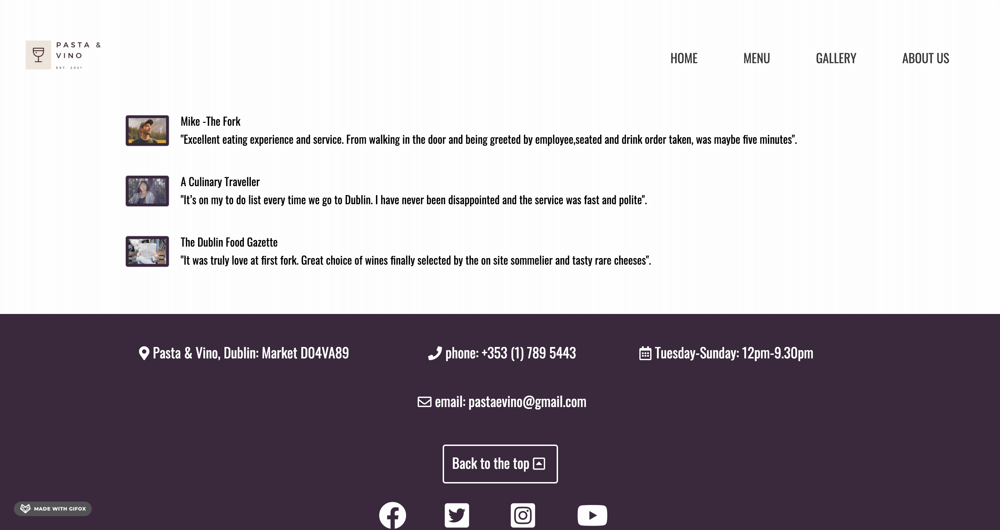
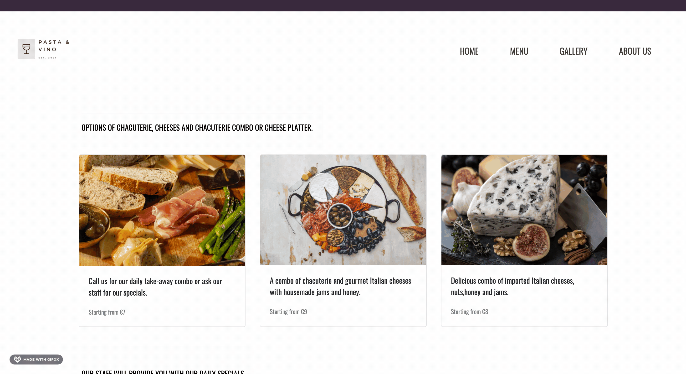
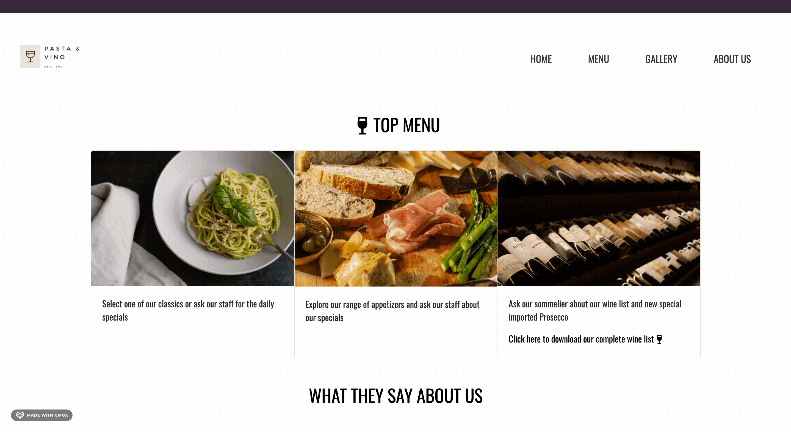
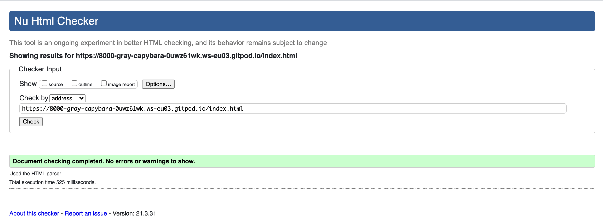
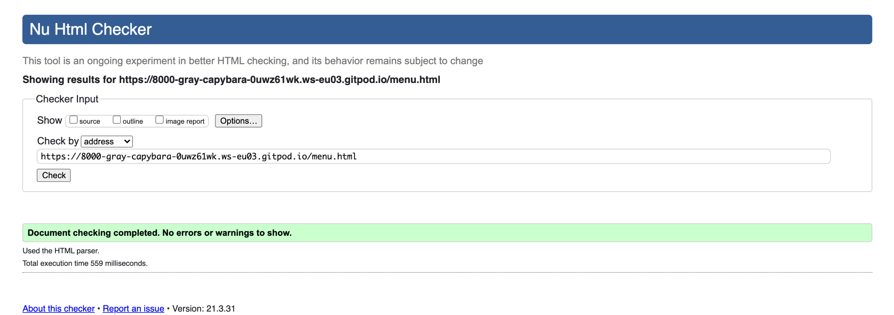
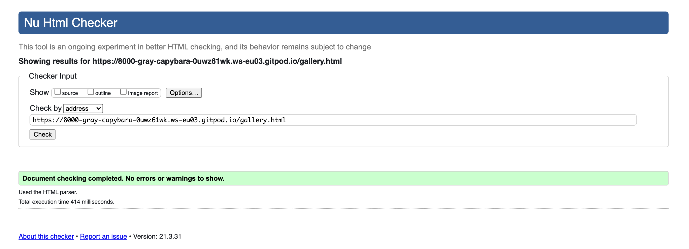
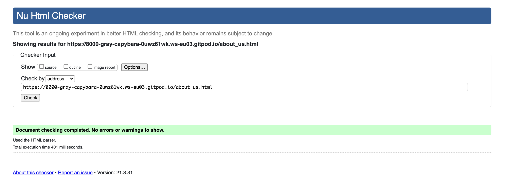
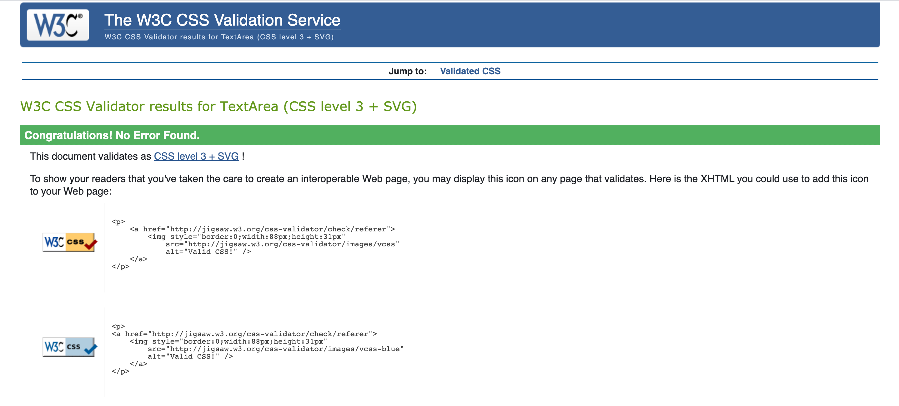

# Pasta & Vino - Testing

[Main README.md file](/README.md)

[View website in GitHub Pages](https://github.com/FrankN88/FrankN88-first_milestone_new)

### Testing User Stories from User Experience (UX) Section

-   #### First Time Visitor Goals

    1. As a First Time Visitor, I want to easily understand the main purpose of the site and learn more about the Restaurant.

        1. Upon entering the site, users are automatically greeted with a clean and easily readable sticky navigation bar to go to the page of their choice. Underneath there is a Carousel that immediately shows the main features of the place and on top of it a link with a catchy phrase that directs to the menu.
        2. The main points are made immediately with carousel images.
        3. The user has several options, click the link that redirects to the menu, one of the links in the navbar or scroll down, where he will see the main features of the place together with a link to an impressive wine list.

    2. As a First Time Visitor, I want to be able to easily be able to navigate throughout the site to find content.

        1. The site has been designed to be fluid and never to entrap the user. At the top of each page there is a clean navigation bar, each link describes what the page they will end up at clearly and change colour when hovering the link.
        2. At the bottom of the each page there is a button that redirects you at the top of the page so that the user does not have to scroll up again, especially on the longer pages and even more if visualised on a small device.
        3. The navigation bar is clearly defined and easily navigable for users to find and use.
        4. The logo image on the top left of each page leads users back to the home page.
        5. The footer menu is easy to use with appropriate icons for easy identification.

    3. As a first time visitor, I want to easily navigate to the restaurant's social links in order to keep up with the latest news and features.
        1. The social links are located in the footer together with the restaurant's contacts.
        2. Social links and contacts always adapt responsively in order to be clicked without any difficulty on any device.
        3. The email and phone in the footer contain a link to facilitate communication with the restaurant.

-   #### Returning Visitor Goals

    1. As a Returning Visitor, I want to find the new features in the menu and updated list of wines.

        1. These are clearly shown in the menu part and easily accessible via the specific links.
        2. The link will immediately open in a new page a pdf list of wines and beverages with prices and details.

    2. As a Returning Visitor, I want to find the best way to get in contact with the organisation with any questions I may have.

        1. Contacts are easily visible in every page in the footer.
        2. In the "About us" page there is a form for communication with the place.
        3. The footer contains links to the organisations Facebook,Youtube, Twitter and Instagram page as well as the organization's email.
        4. The email button is set up to automatically open up your email app and autofill there email address in the "To" section.

    3. As a Returning Visitor, I want to find the social links so that I can join and interact with others in the community.
        1. The Facebook Page can be found at the footer of every page and will open a new tab for the user and more information can be found on the Facebook page.
        2. An interested returning custumer has the chance to immediately click on any link in the footer to be directed to the social networks of the restaurant as much as the Youtube channel.
        3. A little gallery will show parts of the place to a customer who wants to show the restaurant to a friend. The menu page has been thought for the same reason other than showing the main dishes of the moment.

-   #### Frequent User Goals

    1. As a Frequent User, I want to check to see if there are any newly added features in the menu, wine list or events.

        1. The user would already be comfortable with the website layout and can easily check the menu page.

    2. As a Frequent User, I want to check to see if there are any news related to the restaurant acitivity.

        1. The user would already be comfortable with the website layout and can easily click the links to the selected pages. 

    3. As a Frequent User, I want to sign up to the Newsletter so that I am emailed any major updates and/or changes to the website or organisation.
        1. At the bottom of every page there is a footer which content is consistent throughout all pages.
        2. In the page "About us" the users can insert their personal details to receive the newsletter and special offers/events.

## Manual Testing

### Common Elements Testing
Manual testing was conducted on the following pages in order to assess responsiveness,funcionality and usability:

- Hovering over the Navbar will trigger `hover` effect, confirming the link the users are on:

     

- Hovering over Social links will trigger `hover` effect and clicking on them will open a new tab:

     Social link in the footer:

     

- Clicking on the logo will take you back to the home page or refresh it:

     

- Hovering over "LET US SPOIL YOU" in the pages will trigger `hover` effect and clicking on them will redirect you to the menu page:

     

- Clicking on wine list link in the Home Page and Menu page will open a pdf list in another tab:

     

- Hovering over any image in the gallery will trigger `hover` with an ease-in-out effect:

     

### Home Page
Manual testing was conducted on the following elements of the [Home Page](index.html):

 - All the elements are responsive (header,footer, carousel,cards,reviews)
 - The Navbar turns into a toggler icon in smaller devices

   

### Menu Page
Manual testing was conducted on the following elements of the [Home Page](index.html):

 - All the elements are responsive (header,footer,cards,notices at the end)
 - The Navbar turns into a toggler icon in smaller devices

## Automated Testing

### Code Validation
The [W3C Markup Validator](https://validator.w3.org/) service was used to validate the `HTML` code used.

**Results:**

- Home Page

     

- Menu Page

     

- Gallery Page

     

- About us Page

     

The [W3C CSS Validator](https://jigsaw.w3.org/css-validator/) service was used to validate the `CSS` coded used.

**Results:**

### Browser Validation
- Chrome
- Edge
- Opera
- Firefox

## User testing 
Friends and family members were asked to review the site and documentation to point out any feedback and possible way of improving it. Their helpful advice throughout the process led to many UX changes in order to create a better experience, especially regarding the styling. 

It was through this testing that the following changes were made:
- Removing thumbnail from most pictures.
- Centering social media links in the footer instead of floating them to the right.
- Assessing the combinations of colours and the contrast.
- Fonts choice looking smart and not invasive.
- Improving the overall images quality compared to the initial framework idea.
- Overall balance in the positioning and sizing of images in the pages. 

***

